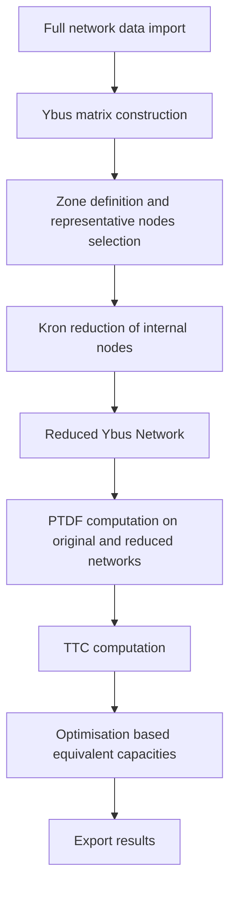

# NetworkReduction.jl

## Overview

**NetworkReduction.jl** is a high-performance Julia package for physics-preserving reduction and equivalencing of large-scale electrical transmission networks.
It provides a mathematically rigorous and computationally efficient workflow for reducing full transmission system models into compact equivalent networks while preserving their power transfer characteristics, congestion behaviour, and operational limits.

The package is specifically designed for power system studies where full network models are too large or computationally expensive to embed inside:

- Optimal Power Flow (OPF)
- Unit Commitment (UC)
- Market simulation
- Adequacy and planning studies
- Long-term energy system models

It enables users to replace large meshed networks with accurate reduced equivalents at zonal, regional, national, or continental scale.

---

## Modelling Scope

NetworkReduction.jl implements a **DC power flow based network equivalencing framework** built on the following modelling principles:

- Linearized DC power flow physics
- Exact Y-bus matrix formulation
- Topology-preserving Kron reduction
- PTDF-based transfer representation
- TTC-based interzonal capacity preservation
- Optimization-based equivalent line fitting

The reduced network preserves:

- Inter-zonal transfer capability
- Congestion behaviour
- Electrical coupling between zones
- Power flow sensitivities
- Transfer bottlenecks

This allows the reduced network to reproduce the operational behaviour of the original system with orders-of-magnitude lower computational burden.

---

## What Problems Does It Solve?

Large-scale power system models (ENTSO-E scale, national grids, offshore grids, energy island networks) often contain:

- Thousands of buses
- Tens of thousands of branches
- Complex meshed topologies

Embedding such models inside optimisation problems leads to:

- Long solution times
- Memory bottlenecks
- Poor numerical conditioning
- Limited scalability

NetworkReduction.jl solves this by:

- Reducing thousands of buses into tens of representative nodes
- Preserving inter-zonal power transfer limits
- Maintaining physical consistency of flows
- Producing compact equivalent networks for fast simulation

This enables fast, accurate, and scalable power system studies.

---

## Typical Use Cases

- European transmission system reduction
- National grid reduction (Ireland, Netherlands, etc.)
- Offshore energy island modelling
- Multi-country interconnection studies
- Power market congestion analysis
- Long-term planning simulations
- Energy system optimisation models
- Adequacy and security assessment

---

## Target Audience

This package is intended for:

- Transmission system operators (TSOs)
- Power system engineers
- Energy system researchers
- Grid planning analysts
- PhD students and academics

---

## Workflow at a glance

1. **Load & clean data** – Read the raw data, remove invalid entries, assign consistent IDs, and convert everything to per-unit values.
2. **Analyse the original grid** – Build the Y-bus, compute PTDF matrices for canonical transactions, and derive TTC limits using the original line capacities.
3. **Select representative nodes** – Group buses by zone/area, then keep the nodes with the highest interconnection degree to serve as the reduced network boundary.
4. **Kron reduction & reduced PTDFs** – Eliminate non-representative nodes while preserving admittance relationships, and recompute PTDFs on the reduced system.
5. **Optimize equivalent capacities** – Solve a linear/quadratic/or linearized MIQP program (via JuMP+HiGHS) to find synthetic line capacities that reproduce the canonical TTC limits within tolerance.
6. **Compare & export** – Generate CSV reports (bus maps, TTC comparison, PTDF results, equivalent capacities) so you can inspect or downstream the reduced model.

---

## Architecture

The reduction workflow is based on a **physics-preserving network equivalencing pipeline**:
This produces a reduced network that reproduces the transfer behaviour of the original system with minimal error.

---

---

## License

MIT License

---

## Citation

If you use this package in academic work, please cite:

> NetworkReduction.jl – A Julia Toolkit for Power System Network Reduction and Equivalencing
